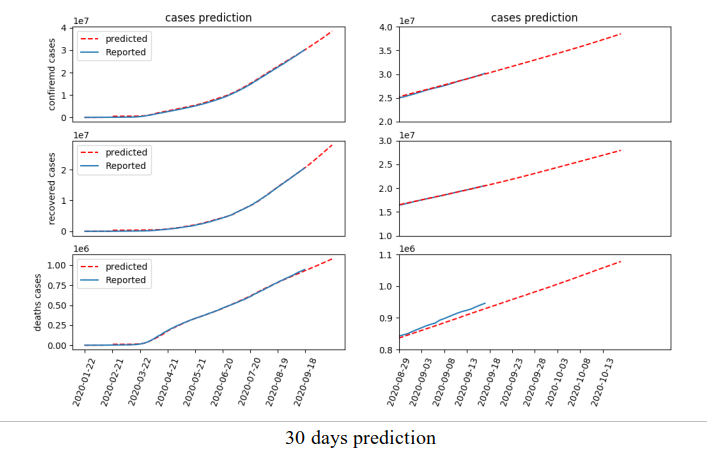

# Start predicting the number of  cases of Covid-19 using LSTM
=========================

Today, the world struggling with Covid-19 pandemic. Estimation the number of cases would be a significant piece of  information for decision makers to decide what policies would be more beneficial not only for controlling Covid-19, but also for making decisions in other area such as preparing for illness and death, demands of medical infrastructure, alerts for the patient overflow, public health emergency response, economical comments and the list goes on.  From the beginning, many researchers have started to use the power of machine learning for predicting the future state of Covid-19 to achieve more reliable approaches.

# LSTM
=================

The first step for using LSTM is that what kind of LSTM would be practical for our purpose. We can divide different approaches of LSTM into six general categories: Vanilla LSTM, Stacked LSTM, CNN LSTM, Encoder-Decoder LSTM, Bidirectional LSTM, Generative LSTM.

• Vanilla LSTM

A simple configuration for LSTM is Vanilla LSTM. It simply do a sequence prediction as a function of previous time steps. Also, this network is robust to the entrance of random time steps on the input sequence.


<p align="center">
  
</p>


 • Stacked LSTM

 This model has multiple hidden LSTM layers containing multiple memory cells. This makes the model deeper suitable for engaging with a large variety of challenging prediction problems. Actually it is capable of representing additional levels of input abstraction over time. It is worth to mentioned that the depth of layer player more important role in Stacked LSTM than the number of memory cells. This method is now among one of the most stable network for prediction.

<p align="center">
  
  
  Mahmoud Tahmasebi
</p>


• CNN LSTM

This model use convolutional  neural network layers for feature extraction of input data and passes the result to an LSTM model for sequence prediction. That is practical for visual time series prediction problems. CNN in this model can be used for assigning labels to inputs as a pre-trained networks. This model is also applicable for speech recognition. 	
 
<p align="center">
  
</p>

• Bidirectional LSTM

As its name shows, this model tries to learn from inputs in both forward and backward directions, meaning that, it doubles the LSTM layer one takes forward format and another takes  its inverse. This model actually provides network with input more than just previous time series contexts. It is successfully used for protein localization and speech recognition.

<p align="center">
  
</p>


• Encoder-Decoder LSTM
When we feed our network with a sequence of input and expect it predicts a sequence of outputs Encoder-Decoder LSTM can be useful. The encoding layer gives a sequence of inputs and turn them to a fixed-length vector and the following layer decode the vector to predicted output. This model widely used for text translation.	

<p align="center">
  
</p>

# Getting start
=================

```bash
cd /path/to/lstm/script

git clone https://github.com/datasets/covid-19
python lstm_c19_stacked_confirmed.py
python lstm_c19_stacked_deaths.py
python lstm_c19_stacked_recoverd.py
```

Outputs are available in trainparam.pkl and trainparam.json

# Results for Stracked LSTM
============================

The worldwide aggregate data taken from  https://github.com/datasets/covid-19 is used as feeding inputs, including confirmed, death and recovered cases from 2020-01-22  to 2020-10-19 to predict 30 days ahead prediction. The following figure shows the model configuration used for this purpose. 80% data used for training and 20% applied for validation.

<p align="center">
  
</p>

<p align="center">
  
</p>

<p align="center">
  
</p>

<p align="center">
  
</p>


# To do
=================

• Implementing Bi-LSTM

• Implementing CNN-LSTM

• Add Gaussian noise to be make the model more robust

• Using different lag/delay for input data
